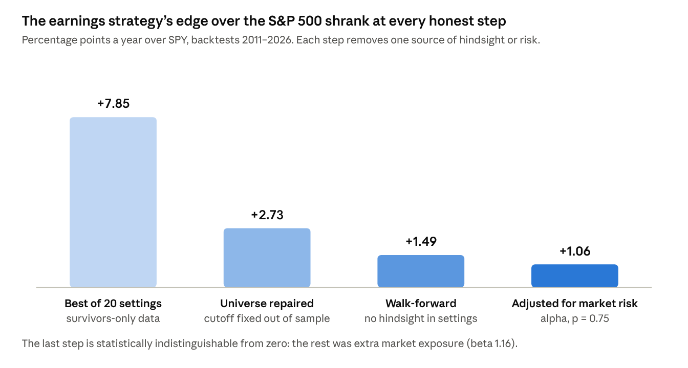
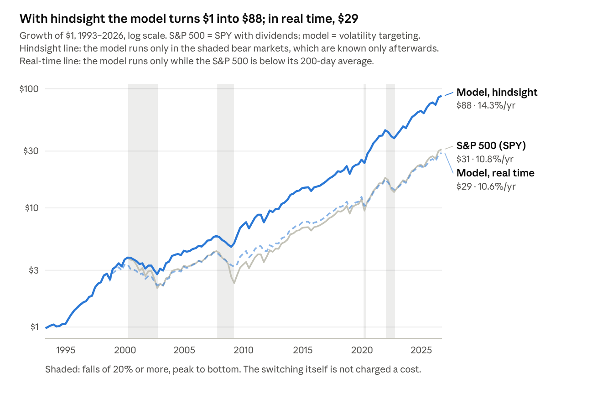
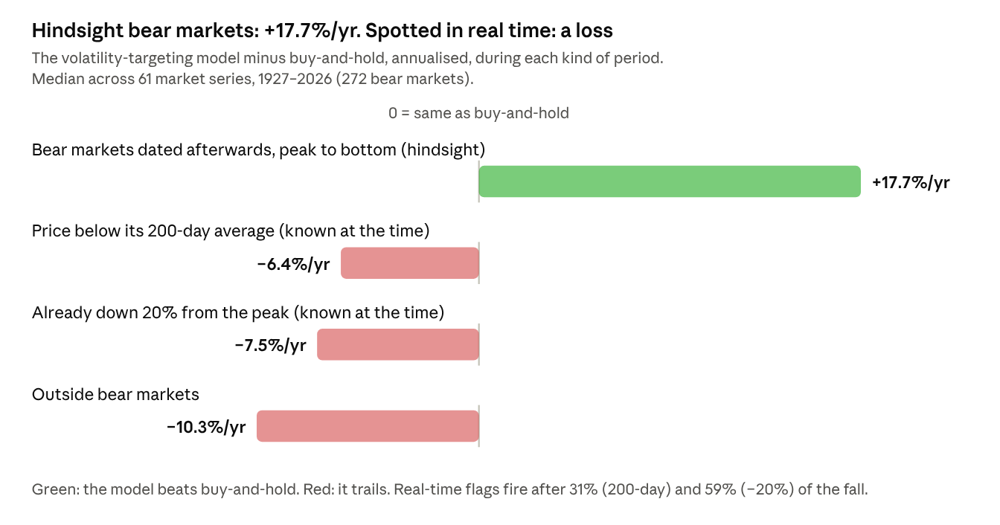
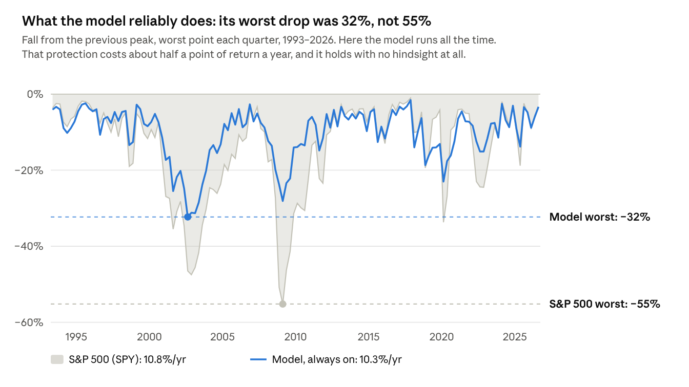
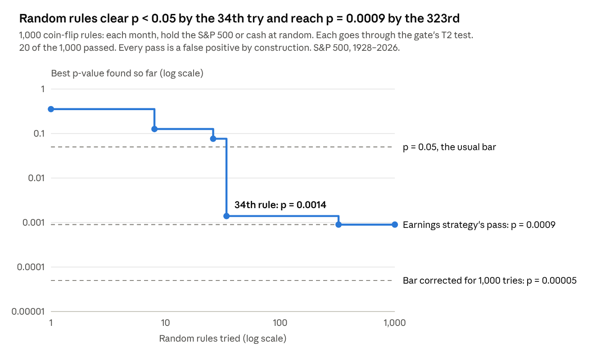

# Findings

What a strict validation gate did to three trading signals, 14–24 September 2026. Every
number here comes from this repository; `PROJECT_STATE.md` has the full record and
`ROADMAP.md` the decisions behind it.

**Short version:** none of the three signals beats the market once overlapping trades,
market risk, survivorship and hindsight are accounted for. The one reliable effect is that
volatility targeting cuts drawdowns, at a small cost in return.

## Constraints

Free data only (yfinance, SEC EDGAR, Wikipedia revision history, Finnhub's free tier), one
laptop (Snapdragon X Plus, native ARM64 Python, CPU inference), SQLite. One code path
serves backtest and live: events → signal → exits and sizing → engine → broker (simulated
market-on-close ledger, or Alpaca paper). The daily decision runs at 14:30 ET and sees only
closes through t−1.

## 1. Universe and survivorship

- S&P 500 membership rebuilt from Wikipedia revisions quarter by quarter (79 snapshots,
  2007-04 to 2026-09), keyed on SEC CIK so ticker changes don't drop firms.
- A silent scraper failure (no retry on throttling, plus a NaN footnote row) had left
  2012-01 to 2014-07 uncollected. Events there were matched against a three-year-stale
  index until it was fixed.
- 2008–10 at 54% price coverage: T2 alpha +24.49%/yr, 95% CI [+1.6, +47.4], on 184 trades.
  The missing half is disproportionately failed firms, so analysis starts 2010-05.
- Missing delisted firms, classified by stated reason: 53% acquired (missing winners), 1%
  failed. Estimated cost to the backtest: 0.3–0.8pp/yr.

## 2. Post-earnings drift

- Signal: price-scaled surprise, percentile-ranked strictly against prior events in a
  trailing 365-day window. The original quarterly deciles had leaked later events into
  earlier ranks.
- Portfolio gate: 4 cutoffs × 5 volatility stops, selection rule pre-registered in the
  script header. On survivors-only data all 20 cells beat SPY (15.5–21.7% CAGR);
  walk-forward kept 9% of the excess.
- Repaired universe, pre-registered top decile: +0.77pp, p=0.063, fail. The top 5% was then
  pre-registered and tested once on 1,152 unseen S&P 400/600 firms: +2.73pp/trade,
  p=0.0009, date-clustered.
- The edge lives in volatile names: top volatility tercile +4.88pp (p=0.001), bottom two
  near zero. Equally volatile ordinary events earn +0.06pp, so it is not beta at the event
  level.
- Then overlap. 60-session holds overlap, so entry dates are not independent. T1 clusters by
  calendar quarter: p=0.021. T2 regresses the monthly returns of an equal-weighted
  calendar-time portfolio of open positions on the matched ETF, Newey-West(3): +2.94%/yr,
  p=0.37, β 1.36. Live config vs SPY: +1.06%/yr, p=0.75, β 1.16. Pooled S&P 1500:
  +0.29%/yr, CI [−5.5, +6.0].

The bars are the headline the project had at each stage (commits `b38916e`, `174fc1f`,
`f734e42`), so they mix measures on purpose: read them as a story of shrinkage, not one
comparable series.

## 3. Reading earnings releases

- **v1**, Finnhub news through FinBERT, FinTone and Twitter-RoBERTa. The calibration was
  cosmetic (rank correlation 0.993–0.999 with raw outputs), and the sentiment tracked the
  prior 10-day return (+0.14), not the surprise (−0.002).
- **v2**, eight pre-registered 8-K features (Loughran-McDonald tone, guidance direction and
  share, similarity to prior releases, filing latency, non-GAAP density). In-sample
  +0.86pp, p=0.009; one-shot 2020–26 holdout +0.43pp, p=0.38.
- **v3**, layered. Parse the EX-99 exhibit of each Item 2.02 8-K and diff every sentence and
  table row against the firm's previous 4 releases: 44% are verbatim, 15% change only
  numbers. Read the first 20 changed sentences, a cap measured to lose nothing.
- Readers: FinBERT and DistilRoBERTa-finance (P(pos) − P(neg), shares, cross-model
  disagreement, bias-corrected scores), plus all-MiniLM-L6-v2 384-d embeddings ridge-mapped
  per sentence to the surprise-orthogonal reaction. A release-level ridge (α=10) is fitted
  on out-of-fold map features, 5 year-block folds.
- Target: the move vs SPY from the last close before the release to the first tradable
  close. Out-of-fold R² on 23,997 releases: surprise alone 0.0716; + word lists 0.0748;
  + FinBERT 0.0798; + DistilRoBERTa 0.0813; + MiniLM 0.0819; everything 0.0853. The
  disagreement feature's gain shrank from +0.0011 at 8,000 releases to +0.0001 at 24,000.
- Drift: the gap (predicted minus actual reaction) forecasts nothing at 5, 20 or 60
  sessions. The decile spread is the bottom falling (−0.79pp vs +0.23pp), so long-only
  top 5% earns −0.05pp/trade; dollar-neutral D10−D1 makes +0.58%/yr, Sharpe 0.14.
- The 27,164-release S&P 400/600 exam set stays unread until a pre-registration exists.

## 4. Volatility targeting

- Premise, from the project's own data: 21-day realised volatility has 0.648
  autocorrelation a month ahead but only 0.063 correlation with the next month's return.
- Rule: w = clip(12% / σ₂₁, 0, 1.5), set at month-end, 2bps per rebalance, margin at
  T-bill + 150bp. Pass = Δ excess Sharpe ≥ +0.10, drawdown cut ≥ 20%, 8 of 12 neighbouring
  (lookback × target) cells improving, and robust at 10bps.
- Seven pre-registered tests: SPY 1993–2001 holdout +0.06 (fail); 17 country ETFs +0.144
  raw but +0.067 excess (fail on the standard measure); S&P 1928–92 +0.19 (pass); 9 sectors
  +0.098 (fail by 0.002); 5 national indices −0.00; 14 emerging markets +0.038, and −0.028
  since 2015.
- What separates wins across 61 series: corr(σ, next-month return) r = −0.718 and vol
  persistence r = +0.457, together r² ≈ 0.52. Split each series in half, and the first half
  predicts the second half's gain at r = +0.151, the wrong sign. It explains; it doesn't
  forecast.
- Permutation: the 1928–92 weights shuffled across months matched +0.186 in 0 of 1,000
  tries (best +0.120). The timing is real; the problem is that ~70% of it is one episode,
  the Depression.
- Correlation-aware weighting (ERC, min-variance) lost to inverse volatility (Sharpe
  0.36–0.49 vs 0.62). Shrinking the covariance to its diagonal restored 0.62: the estimated
  correlations were pure harm.

### Bear markets: hindsight against real time

SPY with dividends, April 1993 to September 2026. The hindsight line runs the model only
in the four shaded bear markets, which can only be dated afterwards. The real-time line
runs it only while the S&P 500 is below its 200-day average, which you can see on the day.
Knowing the bear markets in advance gives 14.3% a year against the index's 10.8%; the
real-time version gives 10.6%.

Across all 61 series the pattern holds: +17.7%/yr over buy-and-hold in hindsight bear
markets, −6.4% and −7.5%/yr under the two real-time definitions, because those fire after
31% and 59% of the fall.

Left on all the time, with no forecasting, the model cut the worst drop from 55% to 32%
for about half a point of return a year. Drawdowns were smaller in 98% of the 61 series.

## 5. Multiple testing and power

- 1,000 coin-flip monthly timing rules through the T2 test: 20 passed; best-of-n p = 0.35,
  0.13, 0.0014, 0.0009 for n = 1, 10, 100, 1,000. Bonferroni at 1,000 trials needs
  p < 0.00005, which no noise reached. Pairwise interactions of 40 flips: 8.2% false
  positives, because pairs share components.
- Pooling the S&P 500 and 400/600: 2.7× the events, 65 → 65 quarters, T2 standard error only
  ~1.4× tighter. Clustered and calendar-time inference is bounded by calendar span, not
  cross-sectional breadth.
- T2 resolves about ±8%/yr here. At a true Sharpe of 0.36, live significance takes ~30
  years; at 0.63, ~10.

## 6. The bugs

Five errors, all five biased upward:

1. `pd.qcut` over the full sample: +8.85 → +1.18%/yr
2. Full-sample mean + k·sd thresholds: +9.54 → +1.65%/yr
3. Out-of-fold models trained on later folds: about half the remaining effect
4. Long/short sign applied after costs, turning short-side costs into gains:
   +1.51 → +0.58%/yr
5. Leverage scaled by full-sample σ, no margin charged: 165× growth, removed

Each now lives in `research/mechanics.py` with a regression test; the suite is 94 tests.

## Reproducing the charts

`research/chart_data.py` recomputes the numbers behind charts 1, 3 and 4 from the
project's own definitions (it needs `data/vol.db`, built by `research/vol_ingest.py`).
Chart 2 is `research/bear_regimes.py`'s output; chart 5 is the recorded backtests.
Switching between the model and buy-and-hold is not charged a cost, as in the analysis.
